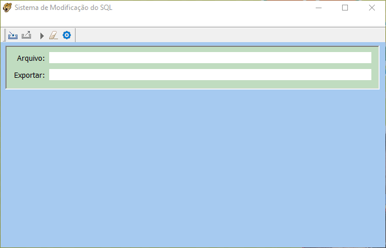
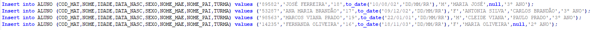
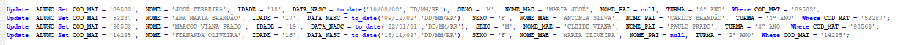

<h1 align="center">SISMOD</h1>

Sistema de modificação de SQL de Insert para Update para os arquivos de exportação do Oracle SQL Developer

<h1 align="center">
  
</h1>

<h1 align="center">IMPORT.sql</h1>

<h1 align="center">EXPORT.sql</h1>

